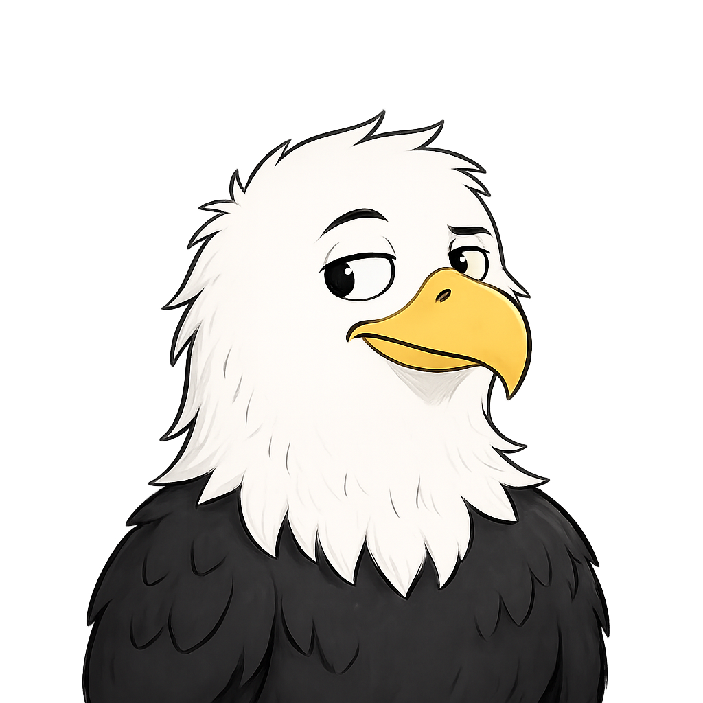

  

  <h1>ShookEagle</h1>

  

    Building open-source mods, plugins, tooling, and infrastructure 
    for gaming communities.
  

  

    <a href="https://www.s2script.com/">Source2Script</a>
    &nbsp;·&nbsp;
    <a href="https://edgm.rs">EdgeGamers</a>
    &nbsp;·&nbsp;
    <a href="https://github.com/ShookEagle?tab=repositories">Projects</a>
  

  
  

###

<picture data-importer="pacman">
  <source media="(prefers-color-scheme: dark)" srcset="https://raw.githubusercontent.com/ShookEagle/ShookEagle/pacman-output/breakout-contribution-graph-dark.svg?game=breakout">
  <source media="(prefers-color-scheme: light)" srcset="https://raw.githubusercontent.com/ShookEagle/ShookEagle/pacman-output/breakout-contribution-graph.svg?game=breakout">
  
</picture>
